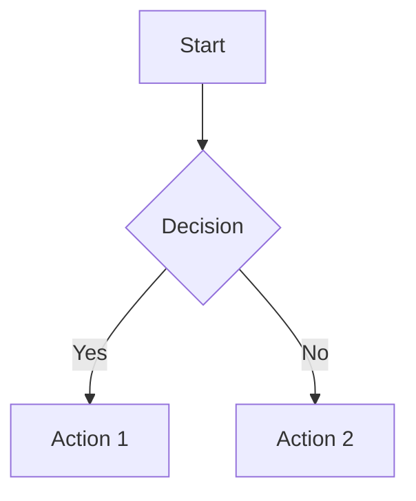

# Documentation Style Guide

This style guide provides guidelines for creating and maintaining documentation for the APIwidget project. Following these guidelines ensures consistency across all documentation and makes it easier for readers to find and understand information.

## Table of Contents

1. [Document Structure](#document-structure)
2. [Formatting Guidelines](#formatting-guidelines)
3. [Writing Style](#writing-style)
4. [Code Examples](#code-examples)
5. [Images and Diagrams](#images-and-diagrams)
6. [Links and References](#links-and-references)
7. [Version Control](#version-control)
8. [File Organization](#file-organization)

## Document Structure

### Document Header

Every document should begin with a header that includes:

```markdown
# Document Title

Brief description of the document's purpose and content.

## Table of Contents

1. [Section 1](#section-1)
2. [Section 2](#section-2)
3. [Section 3](#section-3)
```

### Section Headers

Use header levels consistently:

- `#` (H1): Document title (only one per document)
- `##` (H2): Major sections
- `###` (H3): Subsections
- `####` (H4): Sub-subsections

### Document Footer

End each document with information about maintenance:

```markdown
## Maintenance

This document should be updated when [specific conditions]. Last updated: [date].
```

## Formatting Guidelines

### Lists

Use unordered lists for items without sequence:

```markdown
- Item 1
- Item 2
- Item 3
```

Use ordered lists for sequential steps:

```markdown
1. First step
2. Second step
3. Third step
```

### Tables

Use tables for structured data:

```markdown
| Header 1 | Header 2 | Header 3 |
|----------|----------|----------|
| Value 1  | Value 2  | Value 3  |
| Value 4  | Value 5  | Value 6  |
```

### Emphasis

- Use **bold** for emphasis: `**bold**`
- Use *italics* for definitions or terms: `*italics*`
- Use `code` for code snippets, file names, or technical terms: `` `code` ``

## Writing Style

### Voice and Tone

- Use a professional, clear, and concise tone
- Write in the present tense
- Use active voice instead of passive voice
- Address the reader directly using "you"

### Clarity

- Use simple, direct language
- Define technical terms and acronyms on first use
- Break long sentences into shorter ones
- Use concrete examples to illustrate concepts

### Consistency

- Use consistent terminology throughout all documentation
- Maintain consistent formatting within and across documents
- Follow the same structure for similar types of documents

## Code Examples

### Inline Code

Use backticks for inline code references:

```markdown
Use the `GlassMorphismWidget` component to display the floating widget.
```

### Code Blocks

Use triple backticks with language specification for code blocks:

````markdown
```javascript
function createWidget() {
  const widget = new GlassMorphismWidget({
    size: 'medium',
    theme: 'dark'
  });
  return widget;
}
```
````

### Code Comments

Include comments in code examples to explain complex parts:

````markdown
```javascript
// Create the widget with default settings
const widget = new GlassMorphismWidget();

// Configure the widget position
widget.setPosition(100, 100); // x, y coordinates
```
````

## Images and Diagrams

### Image Inclusion

Include images using the following format:

```markdown

```

### Diagrams

Use Mermaid for diagrams when possible:

````markdown

````

### Screenshots

For screenshots:

- Use descriptive file names
- Crop to show only relevant parts
- Highlight important areas if necessary
- Use consistent resolution and format

## Links and References

### Internal Links

Link to other documentation files using relative paths:

```markdown
See the [Electron Development Guide](./development/ELECTRON_DEVELOPMENT_GUIDE.md) for more information.
```

### External Links

Include descriptive text for external links:

```markdown
Read more about Electron in the [official Electron documentation](https://www.electronjs.org/docs).
```

### API References

When referencing APIs, include links to the relevant documentation:

```markdown
Use the [BrowserWindow](https://www.electronjs.org/docs/api/browser-window) class to create a new window.
```

## Version Control

### Document Versioning

- Follow the versioning guidelines in [VERSION.md](./VERSION.md)
- Update the "Last Updated" date when making changes
- Add a summary of changes to the version history

### Change Tracking

When making significant changes:

1. Update the version number
2. Add an entry to the version history
3. Update cross-references if necessary

## File Organization

### File Naming

- Use UPPERCASE_WITH_UNDERSCORES.md for document names
- Use descriptive names that indicate the content
- Group related documents in appropriate subfolders

### Folder Structure

Organize documentation in the following folders:

- `architecture/`: Technical architecture and design
- `development/`: Development guides and implementation details
- `design/`: UI/UX design guidelines and principles
- `user-guides/`: End-user documentation
- `project-management/`: Project tracking and management documentation
- `archived/`: Deprecated or superseded documents

### Index Files

Each folder should contain a README.md file that serves as an index:

- List all documents in the folder
- Provide a brief description of each document
- Include the last updated date for each document

## Maintenance

This style guide should be updated when new documentation needs arise or when existing guidelines need clarification. All documentation should follow these guidelines to ensure consistency across the project.

Last updated: April 27, 2025
