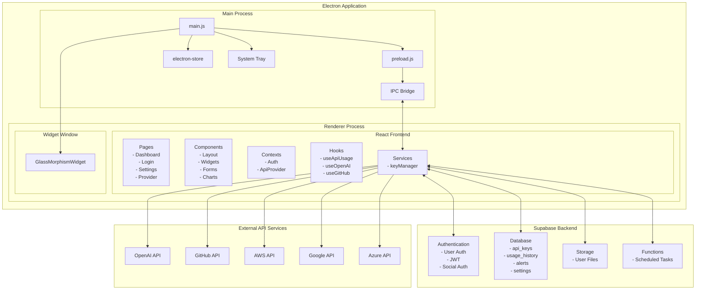
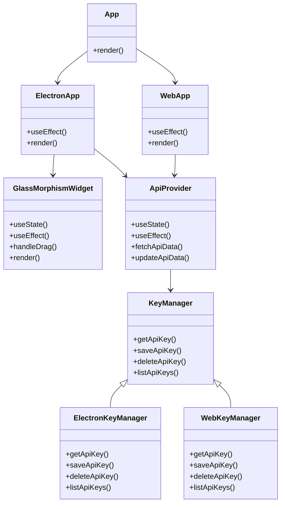
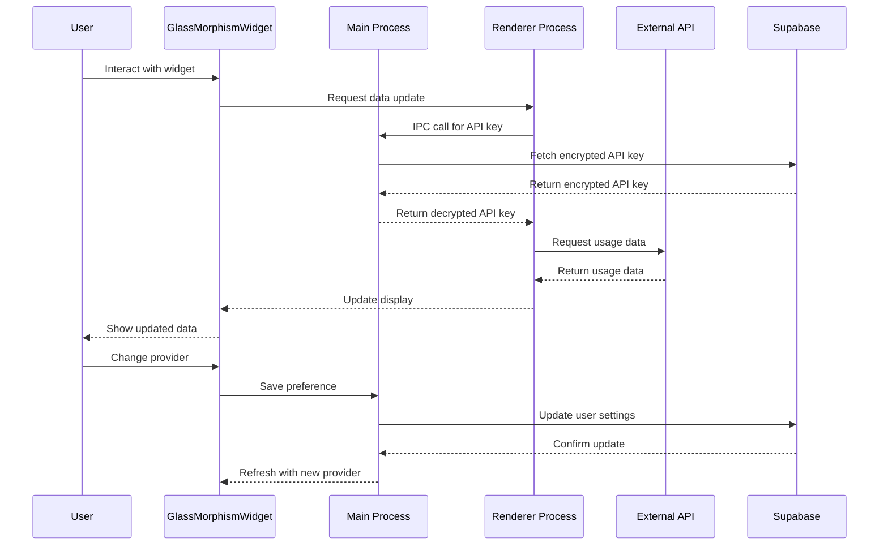

# APIwidget Architecture

## Overview

APIwidget follows a modern React application architecture with a focus on maintainability, performance, and security. The application is built using React with TypeScript and follows a component-based architecture.

## Table of Contents

1. [Architecture Diagram](#architecture-diagram)
2. [Key Components](#key-components)
3. [Data Flow](#data-flow)
4. [Security Considerations](#security-considerations)
5. [Performance Optimizations](#performance-optimizations)
6. [Deployment Architecture](#deployment-architecture)
7. [Project Structure](#project-structure)
8. [Technical Details](#technical-details)

## Architecture Diagram



### Component Architecture



### Data Flow Diagram



## Key Components

### Frontend

1. **Pages**: Top-level components that represent different routes in the application.
   - Dashboard: Main overview of all API usage
   - Login: Authentication page
   - Settings: User and API key management
   - ProviderDetail: Detailed view of a specific API provider

2. **Components**: Reusable UI elements
   - Layout: App layout components (Header, Sidebar)
   - Widgets: Dashboard widgets for displaying API metrics
   - Forms: Input forms for user data
   - Charts: Data visualization components

3. **Contexts**: Global state management
   - AuthContext: User authentication state
   - ApiProviderContext: API provider configuration

4. **Hooks**: Custom React hooks for data fetching and business logic
   - useApiUsage: Generic hook for API usage data
   - useOpenAIUsage: OpenAI-specific usage data
   - useGitHubUsage: GitHub-specific usage data

5. **Services**: Utility functions and API clients
   - keyManager: API key management service

### Backend (Supabase)

1. **Authentication**: User management and authentication
   - JWT-based authentication
   - Social login options
   - Password reset functionality

2. **Database**: PostgreSQL database with the following tables
   - api_keys: Stores user API keys
   - usage_history: Historical API usage data
   - alerts: User-configured alerts
   - user_settings: User preferences

3. **Row-Level Security**: Ensures users can only access their own data
   - Policies on all tables to restrict access based on user_id

## Data Flow

1. **Authentication Flow**:
   - User logs in via Supabase Auth
   - JWT token is stored in local storage
   - AuthContext provides user state to the application

2. **API Key Management Flow**:
   - User adds API key through the UI
   - Key is encrypted and stored in Supabase
   - Row-level security ensures only the user can access their keys

3. **Usage Data Flow**:
   - Application fetches API keys from Supabase
   - Makes requests to external APIs (OpenAI, GitHub, etc.)
   - Processes and displays usage data
   - Optionally stores historical data in Supabase

4. **Alert System Flow**:
   - Regular checks against thresholds
   - Push notifications via service workers
   - Email alerts for critical events

## Security Considerations

1. **API Key Security**:
   - Keys are encrypted before storage
   - Keys are never exposed in client-side code
   - Row-level security ensures users can only access their own keys
   - Only decrypted when needed for API calls

2. **Authentication**:
   - JWT-based authentication with Supabase
   - Secure password policies
   - Session management

3. **Data Privacy**:
   - No usage data stored without explicit consent
   - Data minimization principles applied

## Performance Optimizations

1. **Code Splitting**:
   - React.lazy and Suspense for component loading
   - Dynamic imports for routes

2. **Caching**:
   - API response caching
   - Local storage for non-sensitive data

3. **Rendering Optimizations**:
   - React.memo for expensive components
   - useMemo and useCallback for optimized renders
   - Debouncing for search and filter operations

## Deployment Architecture

The application is deployed using a modern CI/CD pipeline:

1. **Development**: Local development environment
2. **Staging**: Preview environment for testing
3. **Production**: Live environment for end users

Each environment has its own Supabase instance to ensure isolation.

- **CI/CD**: GitHub Actions for automated testing and deployment
- **Monitoring**: Error tracking with Sentry
- **Analytics**: Anonymous usage tracking with Plausible

## Project Structure

```text
apiwidget/
├── electron/               # Electron-specific code
│   ├── main.js             # Main process entry point
│   ├── preload.js          # Preload script for secure IPC
│   └── tests/              # Electron tests
│       └── simple-test.js  # Simple Electron test
├── src/
│   ├── components/         # React components
│   │   └── widgets/        # Widget-related components
│   │       └── GlassMorphismWidget.tsx  # Glass morphism widget component
│   ├── contexts/           # React contexts
│   ├── electron/           # Electron-specific renderer code
│   │   └── widget.js       # Widget bridge file
│   ├── hooks/              # Custom React hooks
│   ├── pages/              # Page components
│   ├── services/           # Service modules
│   │   └── keyManager.ts   # API key management service
│   ├── styles/             # CSS and style files
│   │   └── global.css      # Global styles
│   ├── App.tsx             # Main App component
│   ├── main.tsx            # Entry point
│   └── widget.tsx          # Widget entry point
├── public/                 # Static assets
│   ├── images/             # Image assets
│   ├── tests/              # Test HTML files
│   │   └── test.html       # Test HTML file
│   ├── about.html          # About page
│   ├── widget.html         # Widget HTML template
│   └── widget-bundle.js    # Widget bundle for production
├── docs/                   # Documentation
│   ├── architecture/       # Architecture documentation
│   ├── development/        # Development guides
│   ├── design/             # Design documentation
│   ├── user-guides/        # User guides
│   └── project-management/ # Project management documentation
├── index.html              # Main HTML template
├── package.json            # Project configuration
├── tsconfig.app.json       # TypeScript configuration
└── vite.config.ts          # Vite configuration
```

## Technical Details

### API Key Manager

The API Key Manager handles secure storage and retrieval of API keys:

```typescript
// src/services/keyManager.ts
export interface ApiKeyEntry {
  provider: string;
  key: string;
  label?: string;
  createdAt: Date;
  lastUsed?: Date;
}

// Functions for secure key management
export const saveApiKey = async (provider: string, key: string, label?: string): Promise<void>;
export const getApiKey = async (provider: string): Promise<string | null>;
export const listApiKeys = async (): Promise<ApiKeyEntry[]>;
export const deleteApiKey = async (provider: string): Promise<void>;
```

### Usage Tracking

The Usage Tracking module fetches and processes API usage data:

```typescript
// src/hooks/useApiUsage.ts
export interface UsageData {
  provider: string;
  totalRequests: number;
  totalCost: number;
  quotaUsed: number;
  quotaTotal: number;
  lastUpdated: Date;
}

export const useApiUsage = (provider: string): {
  usage: UsageData | null;
  loading: boolean;
  error: Error | null;
  refresh: () => Promise<void>;
};
```

### Dashboard Widgets

Customizable widgets for displaying API metrics:

```typescript
// src/components/widgets/Widget.tsx
export interface WidgetProps {
  title: string;
  provider: string;
  type: 'usage' | 'cost' | 'quota' | 'history';
  refreshInterval?: number;
  size?: 'small' | 'medium' | 'large';
}
```

### Frontend Architecture

- **Component Structure**: Follows atomic design principles
- **State Management**: React Context API for global state
- **Routing**: React Router for navigation
- **API Communication**: Custom hooks for API interactions
- **Styling**: Emotion/styled-components with Material UI

### Contributing Guidelines

- **Code Style**: ESLint and Prettier
- **Commit Messages**: Conventional Commits format
- **Pull Requests**: Required reviews and passing tests
- **Testing**: Jest for unit tests, React Testing Library for component tests
