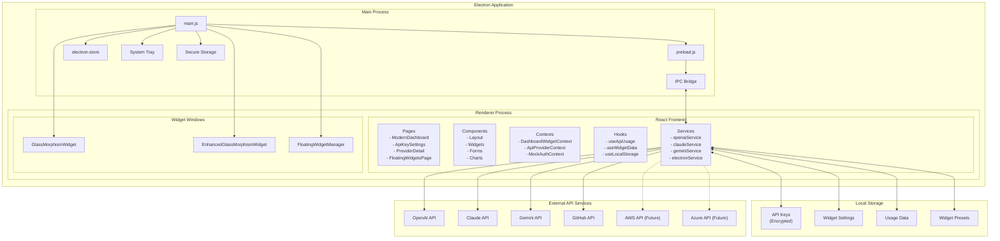
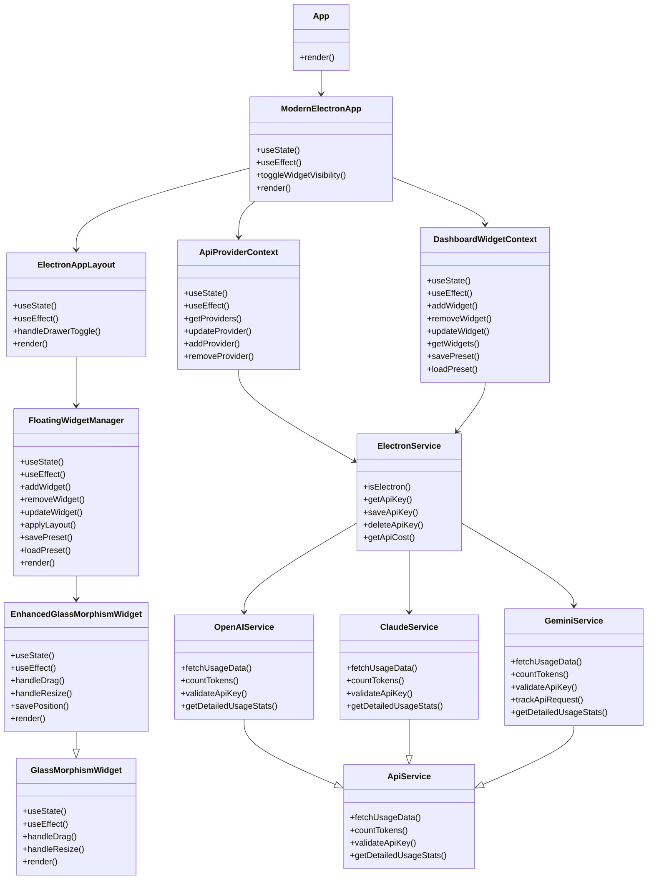
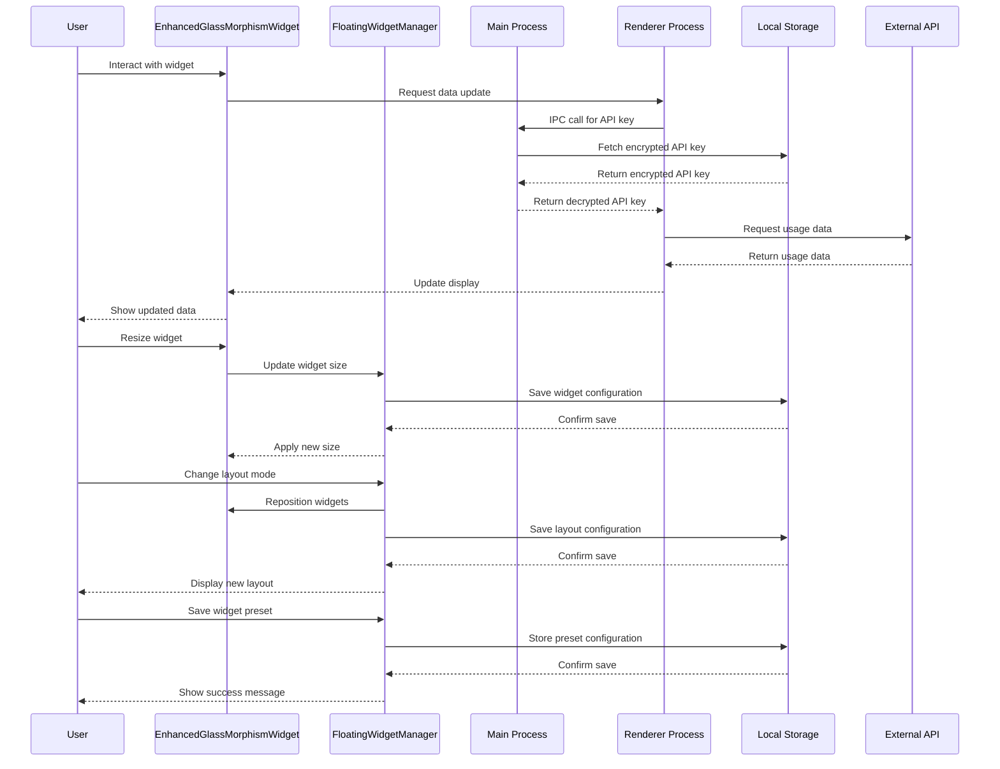

# APIwidget Architecture

## Overview

APIwidget follows a modern React application architecture with a focus on maintainability, performance, and security. The application is built using React with TypeScript and follows a component-based architecture.

## Table of Contents

1. [Architecture Diagram](#architecture-diagram)
2. [Key Components](#key-components)
3. [Data Flow](#data-flow)
4. [Security Considerations](#security-considerations)
5. [Performance Optimizations](#performance-optimizations)
6. [Deployment Architecture](#deployment-architecture)
7. [Project Structure](#project-structure)
8. [Technical Details](#technical-details)

## Architecture Diagram



### Component Architecture



### Data Flow Diagram



## Key Components

### Frontend

1. **Pages**: Top-level components that represent different routes in the application.
   - ModernDashboard: Main overview of all API usage
   - ApiKeySettings: API key management
   - ProviderDetail: Detailed view of a specific API provider
   - FloatingWidgetsPage: Management of multiple floating widgets
   - WidgetGalleryPage: Gallery of available widgets
   - UsagePage: Detailed usage analytics
   - HistoryPage: Request history

2. **Components**: Reusable UI elements
   - Layout: App layout components (ElectronAppLayout, Header, Sidebar)
   - Widgets: Dashboard widgets for displaying API metrics
     - GlassMorphismWidget: Basic glass morphism widget
     - EnhancedGlassMorphismWidget: Enhanced widget with resize and drag
     - FloatingWidgetManager: Manager for multiple widgets
   - Forms: Input forms for user data
   - Charts: Data visualization components

3. **Contexts**: Global state management
   - MockAuthContext: Mock authentication state for development
   - ApiProviderContext: API provider configuration
   - DashboardWidgetContext: Widget configuration and state

4. **Hooks**: Custom React hooks for data fetching and business logic
   - useApiUsage: Generic hook for API usage data
   - useWidgetData: Hook for widget data management
   - useLocalStorage: Hook for local storage management

5. **Services**: Utility functions and API clients
   - openaiService: OpenAI API integration
   - claudeService: Claude API integration
   - geminiService: Gemini API integration
   - electronService: Electron integration
   - apiIntegrationService: Generic API integration
   - enhancedApiService: Enhanced API service with caching
   - mockDataService: Mock data for development

### Local Storage

1. **API Keys**: Securely stored API keys
   - Encrypted using machine-specific encryption
   - Stored locally on the user's device
   - Never transmitted to external servers

2. **Widget Settings**: Configuration for widgets
   - Position, size, and appearance
   - Provider selection
   - Refresh interval

3. **Usage Data**: Historical usage data
   - Daily usage statistics
   - Model-specific usage
   - Token distribution

4. **Widget Presets**: Saved widget configurations
   - Layout presets
   - Widget combinations
   - Custom configurations

## Data Flow

1. **Authentication Flow**:
   - User logs in via mock authentication (real auth to be implemented)
   - Authentication state is managed by MockAuthContext
   - Protected routes require authentication

2. **API Key Management Flow**:
   - User adds API key through the API Key Settings page
   - Key is validated against the provider's API
   - Key is encrypted and stored locally
   - Key is only decrypted when needed for API calls

3. **Usage Data Flow**:
   - Application retrieves encrypted API keys from local storage
   - Keys are decrypted securely in the main process
   - Application makes requests to external APIs (OpenAI, Claude, Gemini)
   - Real-time token counting and cost calculation
   - Usage data is stored locally for historical analysis
   - Dashboard and widgets display the processed data

4. **Widget Management Flow**:
   - User creates and configures widgets through the Floating Widgets page
   - Widget configurations are stored in DashboardWidgetContext
   - FloatingWidgetManager handles widget positioning and layout
   - Widget presets can be saved and restored
   - Widgets can be freely resized and positioned

5. **Real-Time API Tracking Flow**:
   - API requests are tracked in real-time
   - Token usage is counted accurately using provider-specific methods
   - Costs are calculated based on current pricing
   - Usage statistics are updated and stored locally
   - Widgets and dashboard display up-to-date information

## Security Considerations

1. **API Key Security**:
   - Keys are encrypted before storage
   - Keys are never exposed in client-side code
   - Row-level security ensures users can only access their own keys
   - Only decrypted when needed for API calls

2. **Authentication**:
   - JWT-based authentication with Supabase
   - Secure password policies
   - Session management

3. **Data Privacy**:
   - No usage data stored without explicit consent
   - Data minimization principles applied

## Performance Optimizations

1. **Code Splitting**:
   - React.lazy and Suspense for component loading
   - Dynamic imports for routes

2. **Caching**:
   - API response caching
   - Local storage for non-sensitive data

3. **Rendering Optimizations**:
   - React.memo for expensive components
   - useMemo and useCallback for optimized renders
   - Debouncing for search and filter operations

## Deployment Architecture

The application is deployed using a modern CI/CD pipeline:

1. **Development**: Local development environment
2. **Staging**: Preview environment for testing
3. **Production**: Live environment for end users

Each environment has its own Supabase instance to ensure isolation.

- **CI/CD**: GitHub Actions for automated testing and deployment
- **Monitoring**: Error tracking with Sentry
- **Analytics**: Anonymous usage tracking with Plausible

## Project Structure

```text
APIwidget/
├── APIwidget/              # Main project directory
│   ├── electron/           # Electron-specific code
│   │   ├── main.js         # Main process entry point
│   │   ├── preload.js      # Preload script for secure IPC
│   │   └── tests/          # Electron tests
│   ├── public/             # Static assets
│   │   ├── images/         # Image assets
│   │   ├── widget.html     # Widget HTML template
│   │   └── index.html      # Main HTML template
│   ├── src/                # Source code
│   │   ├── components/     # React components
│   │   │   ├── app/        # App-level components
│   │   │   │   └── ModernElectronApp.tsx  # Main app component
│   │   │   ├── layout/     # Layout components
│   │   │   │   └── ElectronAppLayout.tsx  # Main layout component
│   │   │   ├── settings/   # Settings components
│   │   │   │   ├── GeminiApiSettings.tsx  # Gemini API settings
│   │   │   │   ├── OpenAIApiSettings.tsx  # OpenAI API settings
│   │   │   │   └── ClaudeApiSettings.tsx  # Claude API settings
│   │   │   └── widgets/    # Widget components
│   │   │       ├── GlassMorphismWidget.tsx       # Basic glass morphism widget
│   │   │       ├── EnhancedGlassMorphismWidget.tsx  # Enhanced widget
│   │   │       └── FloatingWidgetManager.tsx     # Widget manager
│   │   ├── contexts/       # React contexts
│   │   │   ├── ApiProviderContext.tsx     # API provider context
│   │   │   ├── DashboardWidgetContext.tsx # Dashboard widget context
│   │   │   └── MockAuthContext.tsx        # Mock auth context
│   │   ├── hooks/          # Custom React hooks
│   │   │   ├── useApiUsage.ts             # API usage hook
│   │   │   ├── useWidgetData.ts           # Widget data hook
│   │   │   └── useLocalStorage.ts         # Local storage hook
│   │   ├── pages/          # Page components
│   │   │   ├── ModernDashboard.tsx        # Main dashboard
│   │   │   ├── ApiKeySettings.tsx         # API key settings
│   │   │   ├── FloatingWidgetsPage.tsx    # Floating widgets page
│   │   │   ├── ProviderDetail.tsx         # Generic provider detail
│   │   │   └── providers/                 # Provider-specific pages
│   │   │       ├── OpenAIProviderDetail.tsx  # OpenAI details
│   │   │       ├── ClaudeProviderDetail.tsx  # Claude details
│   │   │       └── GeminiProviderDetail.tsx  # Gemini details
│   │   ├── services/       # Service modules
│   │   │   ├── openaiService.ts           # OpenAI service
│   │   │   ├── claudeService.ts           # Claude service
│   │   │   ├── geminiService.ts           # Gemini service
│   │   │   ├── electronService.ts         # Electron service
│   │   │   ├── apiIntegrationService.ts   # API integration service
│   │   │   ├── enhancedApiService.ts      # Enhanced API service
│   │   │   └── mockDataService.ts         # Mock data service
│   │   ├── styles/         # CSS and style files
│   │   │   ├── global.css                 # Global styles
│   │   │   └── components/                # Component-specific styles
│   │   │       └── widgets/               # Widget styles
│   │   │           ├── GlassMorphismWidget.css  # Widget styles
│   │   │           └── FloatingWidgetManager.css # Manager styles
│   │   ├── types/          # TypeScript type definitions
│   │   │   ├── api.ts                     # API types
│   │   │   └── widget.ts                  # Widget types
│   │   ├── App.tsx         # Main App component
│   │   └── main.tsx        # Entry point
│   ├── package.json        # Project dependencies
│   └── vite.config.ts      # Vite configuration
├── docs/                   # Documentation
│   ├── architecture/       # Architecture documentation
│   ├── development/        # Development guides
│   │   ├── AI_API_COST_TRACKING.md        # API cost tracking docs
│   │   ├── GEMINI_API_INTEGRATION.md      # Gemini integration docs
│   │   ├── MULTIPLE_FLOATING_WIDGETS.md   # Multiple widgets docs
│   │   └── SECURE_API_KEY_STORAGE.md      # API key storage docs
│   ├── design/             # Design documentation
│   ├── user-guides/        # User guides
│   └── project-management/ # Project management documentation
└── run-widget.bat          # Script to run the widget
```

## Technical Details

### API Services

The API services handle integration with external API providers:

```typescript
// src/services/geminiService.ts
export interface GeminiUsageData {
  total: number;
  previousTotal: number;
  usagePercentage: number;
  requests: number;
  inputTokens: number;
  outputTokens: number;
  lastUpdated: string;
  dailyUsage: Record<string, {
    date: string;
    requests: number;
    inputTokens: number;
    outputTokens: number;
    cost: number;
  }>;
  models: Record<string, {
    requests: number;
    inputTokens: number;
    outputTokens: number;
    cost: number;
  }>;
}

// Functions for Gemini API integration
export const fetchUsageData = async (): Promise<ApiCostData>;
export const countTokens = async (text: string): Promise<number>;
export const validateApiKey = async (apiKey: string): Promise<boolean>;
export const trackApiRequest = async (inputTokens: number, outputTokens: number, model?: string): Promise<void>;
export const getDetailedUsageStats = (): DetailedUsageStats;
```

### Widget Management

The FloatingWidgetManager handles multiple widgets:

```typescript
// src/components/widgets/FloatingWidgetManager.tsx
export interface WidgetConfig {
  id: string;
  providerId: string;
  type: 'cost' | 'usage' | 'requests';
  size: 'small' | 'medium' | 'large';
  position: { x: number; y: number };
  isVisible: boolean;
  customSize?: { width: number; height: number };
}

export interface WidgetPreset {
  id: string;
  name: string;
  widgets: WidgetConfig[];
  layout: 'free' | 'grid' | 'line';
  createdAt: string;
}

// Functions for widget management
export const addWidget = (config: Partial<WidgetConfig>): void;
export const removeWidget = (id: string): void;
export const updateWidget = (id: string, updates: Partial<WidgetConfig>): void;
export const savePreset = (name: string): void;
export const loadPreset = (presetId: string): void;
```

### Enhanced Glass Morphism Widget

The EnhancedGlassMorphismWidget provides a resizable and draggable widget:

```typescript
// src/components/widgets/EnhancedGlassMorphismWidget.tsx
export interface EnhancedGlassMorphismWidgetProps {
  widgetId: string;
  providerId: string;
  initialSize?: 'small' | 'medium' | 'large';
  initialPosition?: { x: number; y: number };
  onOpenSettings?: () => void;
  onClose?: () => void;
  isElectronApp?: boolean;
  customSize?: { width: number; height: number };
}

// Widget component with resize and drag functionality
export const EnhancedGlassMorphismWidget: React.FC<EnhancedGlassMorphismWidgetProps>;
```

### Frontend Architecture

- **Component Structure**: Follows atomic design principles
- **State Management**: React Context API for global state
- **Routing**: React Router for navigation
- **API Communication**: Custom hooks for API interactions
- **Styling**: Emotion/styled-components with Material UI

### Contributing Guidelines

- **Code Style**: ESLint and Prettier
- **Commit Messages**: Conventional Commits format
- **Pull Requests**: Required reviews and passing tests
- **Testing**: Jest for unit tests, React Testing Library for component tests
