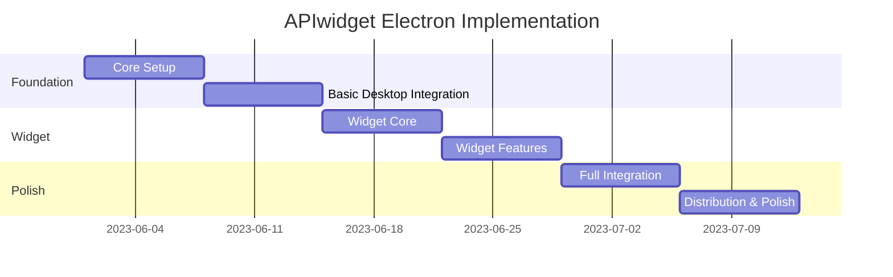

# APIwidget Project Tracking

## Project Overview

**Project Name**: APIwidget Electron Implementation  
**Start Date**: [Current Date]  
**Target Completion**: [Current Date + 6 weeks]  
**Project Manager**: [Your Name]  
**Lead Developer**: [Lead Developer Name]

## Project Goals

1. Transform the APIwidget web application into a desktop application using Electron
2. Implement a floating widget for real-time API cost monitoring
3. Create a seamless user experience across web and desktop platforms
4. Ensure secure storage of sensitive API keys
5. Deliver a production-ready application with installers for Windows, macOS, and Linux

## Project Timeline



## Sprint Schedule

| Sprint | Dates | Focus | Key Deliverables |
|--------|-------|-------|------------------|
| Sprint 1 | [Week 1] | Core Setup | Electron project structure, IPC communication, build pipeline |
| Sprint 2 | [Week 2] | Desktop Integration | Secure storage, system tray, auto-start, notifications |
| Sprint 3 | [Week 3] | Widget Core | Standalone widget window, persistence, toggle controls |
| Sprint 4 | [Week 4] | Widget Features | Real-time updates, customization, interactions |
| Sprint 5 | [Week 5] | Full Integration | Multi-provider support, shared state, alerts |
| Sprint 6 | [Week 6] | Distribution | Auto-updates, installers, final polish |

## Key Performance Indicators (KPIs)

### Development KPIs

- **Sprint Velocity**: Story points completed per sprint
- **Code Quality**: Test coverage percentage
- **Bug Density**: Number of bugs per 1000 lines of code
- **Build Success Rate**: Percentage of successful builds in CI

### Product KPIs

- **Widget Performance**: Memory and CPU usage
- **Startup Time**: Time to fully load the application
- **User Engagement**: Time spent with widget visible
- **Feature Adoption**: Percentage of users using key features

## Risk Management

| Risk | Probability | Impact | Mitigation Strategy |
|------|------------|--------|---------------------|
| Electron security vulnerabilities | Medium | High | Regular dependency updates, security audits |
| Cross-platform compatibility issues | High | Medium | Comprehensive testing on all target platforms |
| Performance degradation | Medium | Medium | Performance profiling, optimization sprints |
| API rate limiting | Low | High | Implement caching, throttling, and fallback mechanisms |
| User adoption resistance | Medium | High | Focus on UX, provide clear value proposition |

## Team Structure

### Core Team

- **Project Manager**: Overall project coordination
- **Lead Developer**: Technical direction and architecture
- **Frontend Developer**: React components and UI
- **Electron Specialist**: Desktop integration
- **QA Engineer**: Testing and quality assurance

### Extended Team

- **UX Designer**: User experience and interface design
- **DevOps Engineer**: CI/CD pipeline and deployment
- **Technical Writer**: Documentation and user guides

## Communication Plan

### Regular Meetings

- **Daily Standup**: 15 minutes, every workday at 10:00 AM
- **Sprint Planning**: 1 hour, first day of each sprint
- **Sprint Review**: 30 minutes, last day of each sprint
- **Sprint Retrospective**: 30 minutes, last day of each sprint
- **Backlog Grooming**: 1 hour, bi-weekly

### Communication Channels

- **Slack**: Daily communication and quick updates
- **GitHub Issues**: Bug tracking and feature requests
- **Jira/Trello**: Sprint and backlog management
- **Google Meet/Zoom**: Video meetings
- **Confluence/Notion**: Documentation and knowledge sharing

## Issue Tracking

We use GitHub Issues for tracking bugs, features, and tasks. Each issue should include:

1. **Title**: Clear, concise description
2. **Description**: Detailed explanation
3. **Type**: Bug, Feature, Task, or Documentation
4. **Priority**: Critical, High, Medium, or Low
5. **Assignee**: Responsible team member
6. **Labels**: Relevant categories
7. **Milestone**: Target sprint or release

### Issue Template

```markdown
## Description
[Detailed description of the issue]

## Acceptance Criteria
- [ ] Criterion 1
- [ ] Criterion 2
- [ ] Criterion 3

## Technical Notes
[Any technical details or implementation notes]

## Dependencies
[Any dependencies on other issues or external factors]
```

## Pull Request Process

1. **Create Branch**: Create a feature branch from develop
2. **Implement Changes**: Make necessary code changes
3. **Write Tests**: Add or update tests
4. **Submit PR**: Create pull request with description
5. **Code Review**: At least one approval required
6. **CI Checks**: All tests must pass
7. **Merge**: Merge to develop branch

### PR Template

```markdown
## Description
[Description of the changes]

## Related Issue
[Link to the related issue]

## Type of Change
- [ ] Bug fix
- [ ] New feature
- [ ] Breaking change
- [ ] Documentation update

## How Has This Been Tested?
[Description of testing approach]

## Checklist
- [ ] My code follows the project's style guidelines
- [ ] I have performed a self-review of my code
- [ ] I have commented my code, particularly in hard-to-understand areas
- [ ] I have made corresponding changes to the documentation
- [ ] My changes generate no new warnings
- [ ] I have added tests that prove my fix is effective or that my feature works
- [ ] New and existing unit tests pass locally with my changes
```

## Release Process

### Release Types

- **Alpha**: Internal testing only
- **Beta**: Limited external testing
- **Release Candidate**: Feature complete, bug fixing
- **Production**: Stable release

### Release Checklist

- [ ] All planned features implemented
- [ ] All tests passing
- [ ] Documentation updated
- [ ] Version numbers updated
- [ ] Release notes prepared
- [ ] Installers built and tested
- [ ] Security audit completed
- [ ] Performance benchmarks acceptable

### Release Notes Template

```markdown
# APIwidget v1.0.0

## New Features
- Feature 1: [Description]
- Feature 2: [Description]
- Feature 3: [Description]

## Improvements
- Improvement 1: [Description]
- Improvement 2: [Description]

## Bug Fixes
- Bug 1: [Description]
- Bug 2: [Description]

## Known Issues
- Issue 1: [Description and workaround if available]
- Issue 2: [Description and workaround if available]

## Installation
[Installation instructions]
```

## Documentation

### Technical Documentation

- **Architecture Overview**: System design and components
- **API Documentation**: Internal and external APIs
- **Development Guide**: Setup and contribution guidelines
- **Testing Guide**: Testing procedures and tools

### User Documentation

- **Installation Guide**: How to install the application
- **User Manual**: How to use the application
- **FAQ**: Common questions and answers
- **Troubleshooting Guide**: Common issues and solutions

## Project Status Reporting

### Weekly Status Report

```markdown
# Weekly Status Report: [Date]

## Accomplishments
- [List of completed tasks]

## In Progress
- [List of tasks in progress]

## Blockers
- [List of blockers and mitigation plans]

## Next Week's Goals
- [List of goals for next week]

## Metrics
- Sprint Velocity: [Value]
- Bug Count: [Value]
- Test Coverage: [Value]
```

### Monthly Executive Summary

```markdown
# Executive Summary: [Month]

## Project Status
[Overall status: On Track, At Risk, or Off Track]

## Key Achievements
- [Major milestones reached]

## Challenges
- [Significant challenges and mitigation strategies]

## Budget Status
- Planned: [Value]
- Actual: [Value]
- Variance: [Value]

## Timeline Status
- Planned Completion: [Date]
- Forecasted Completion: [Date]
- Variance: [Days]

## Next Steps
- [Key activities for the next month]
```

## Tools and Resources

### Development Tools

- **IDE**: Visual Studio Code
- **Version Control**: Git/GitHub
- **CI/CD**: GitHub Actions
- **Package Manager**: npm
- **Build Tool**: Electron Builder

### Project Management Tools

- **Issue Tracking**: GitHub Issues
- **Project Board**: GitHub Projects or Jira
- **Documentation**: Markdown in repository
- **Time Tracking**: Toggl or Harvest

### Testing Tools

- **Unit Testing**: Jest
- **Integration Testing**: Spectron
- **E2E Testing**: Playwright
- **Performance Testing**: Lighthouse

## Appendix

### Glossary

- **Electron**: Framework for building cross-platform desktop applications with web technologies
- **IPC**: Inter-Process Communication, method for main and renderer processes to communicate
- **Renderer Process**: Process that runs the web UI in Electron
- **Main Process**: Process that runs Node.js in Electron
- **Widget**: Small, floating UI element showing API cost information
