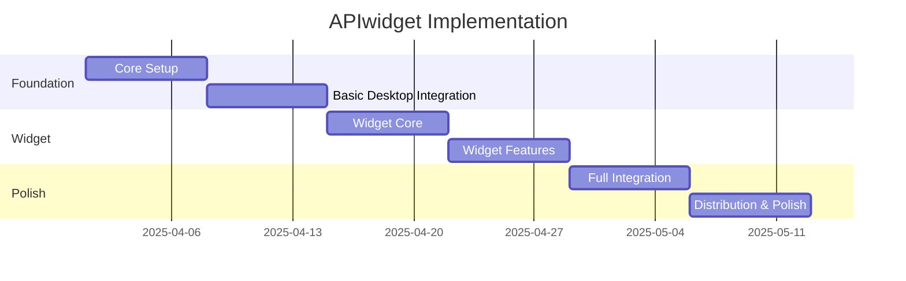

# APIwidget Project Management

## Project Overview

**Project Name**: APIwidget  
**Description**: A floating widget for Windows that displays API costs in real-time, similar to stock price trackers, using Electron with a glass morphism UI design.

## Project Goals

1. Create a floating widget for real-time API cost monitoring
2. Implement a glass morphism UI design for a modern look and feel
3. Support multiple API providers (OpenAI, GitHub, AWS)
4. Ensure secure storage of sensitive API keys
5. Deliver a production-ready application with installers for Windows

## Project Timeline



## Development Approach

### Core Principles

1. **Modular and Simple Approach**
   - Avoid duplicates or over-engineering code
   - Check existing implementations before creating new ones
   - Favor clean, maintainable solutions over complex ones

2. **Single Source of Truth**
   - Maintain a clean code structure
   - Avoid redundant files and messy organization
   - Use a consistent approach to state management

3. **Step-by-Step Implementation**
   - Follow a test-then-implement methodology
   - Make small, incremental changes
   - Validate each step before moving to the next

4. **Modern UI/UX Design**
   - Implement minimal modern 2025 UI/UX
   - Focus on glass-like, low-impact UI design
   - Prioritize functionality that delivers value quickly

### Technology Stack

- **Frontend**: React 19, TypeScript
- **UI Library**: Material UI 7
- **Build Tool**: Vite 6
- **Desktop Framework**: Electron 29
- **State Management**: React Context API
- **Database/Auth**: Supabase
- **API Integration**: Axios
- **Charts/Visualization**: Recharts

## Project Structure

```text
apiwidget/
├── electron/               # Electron-specific code
│   ├── main.js             # Main process entry point
│   ├── preload.js          # Preload script for secure IPC
│   └── tests/              # Electron tests
│       └── simple-test.js  # Simple Electron test
├── src/
│   ├── components/         # React components
│   │   └── widgets/        # Widget-related components
│   │       └── GlassMorphismWidget.tsx  # Glass morphism widget component
│   ├── contexts/           # React contexts
│   ├── electron/           # Electron-specific renderer code
│   │   └── widget.js       # Widget bridge file
│   ├── hooks/              # Custom React hooks
│   ├── pages/              # Page components
│   ├── services/           # Service modules
│   │   └── keyManager.ts   # API key management service
│   ├── styles/             # CSS and style files
│   │   └── global.css      # Global styles
│   ├── App.tsx             # Main App component
│   ├── main.tsx            # Entry point
│   └── widget.tsx          # Widget entry point
├── public/                 # Static assets
│   ├── images/             # Image assets
│   ├── tests/              # Test HTML files
│   │   └── test.html       # Test HTML file
│   ├── about.html          # About page
│   ├── widget.html         # Widget HTML template
│   └── widget-bundle.js    # Widget bundle for production
├── docs/                   # Documentation
│   ├── architecture/       # Architecture documentation
│   ├── development/        # Development guides
│   ├── design/             # Design documentation
│   ├── user-guides/        # User guides
│   └── project-management/ # Project management documentation
```

## Current Status

### Completed

- [x] Project setup with Electron, React, and TypeScript
- [x] Basic Electron configuration
- [x] Glass morphism widget implementation
- [x] Widget positioning and persistence
- [x] Project structure organization

### In Progress

- [ ] Real-time data fetching from API providers
- [ ] Widget customization options
- [ ] Main application interface
- [ ] Authentication with Supabase
- [ ] API key management

### Upcoming

- [ ] Multiple API provider support
- [ ] Alert system for API usage thresholds
- [ ] Settings panel for widget customization
- [ ] System tray integration
- [ ] Installer creation

## Issue Tracking

We use GitHub Issues for tracking bugs, features, and tasks. Each issue should include:

1. **Title**: Clear, concise description
2. **Description**: Detailed explanation
3. **Type**: Bug, Feature, Task, or Documentation
4. **Priority**: Critical, High, Medium, or Low
5. **Assignee**: Responsible team member
6. **Labels**: Relevant categories
7. **Milestone**: Target sprint or release

### Issue Template

```markdown
## Description
[Detailed description of the issue]

## Acceptance Criteria
- [ ] Criterion 1
- [ ] Criterion 2
- [ ] Criterion 3

## Technical Notes
[Any technical details or implementation notes]

## Dependencies
[Any dependencies on other issues or external factors]
```

## Pull Request Process

1. **Create Branch**: Create a feature branch from develop
2. **Implement Changes**: Make necessary code changes
3. **Write Tests**: Add or update tests
4. **Submit PR**: Create pull request with description
5. **Code Review**: At least one approval required
6. **CI Checks**: All tests must pass
7. **Merge**: Merge to develop branch

### PR Template

```markdown
## Description
[Description of the changes]

## Related Issue
[Link to the related issue]

## Type of Change
- [ ] Bug fix
- [ ] New feature
- [ ] Breaking change
- [ ] Documentation update

## How Has This Been Tested?
[Description of testing approach]

## Checklist
- [ ] My code follows the project's style guidelines
- [ ] I have performed a self-review of my code
- [ ] I have commented my code, particularly in hard-to-understand areas
- [ ] I have made corresponding changes to the documentation
- [ ] My changes generate no new warnings
- [ ] I have added tests that prove my fix is effective or that my feature works
- [ ] New and existing unit tests pass locally with my changes
```

## Testing Strategy

### Types of Tests

- **Unit Tests**: Test individual components and functions
- **Integration Tests**: Test interactions between components
- **End-to-End Tests**: Test the application as a whole
- **Visual Regression Tests**: Test UI components for visual changes

### Testing Tools

- **Jest**: Unit and integration testing
- **React Testing Library**: Component testing
- **Spectron**: Electron application testing
- **Playwright**: End-to-end testing

## Documentation

### Technical Documentation

- **Architecture Overview**: System design and components
- **API Documentation**: Internal and external APIs
- **Development Guide**: Setup and contribution guidelines
- **Testing Guide**: Testing procedures and tools

### User Documentation

- **Installation Guide**: How to install the application
- **User Manual**: How to use the application
- **FAQ**: Common questions and answers
- **Troubleshooting Guide**: Common issues and solutions

## Next Steps

1. **Implement Real-time Data Fetching**
   - Create services for fetching data from API providers
   - Implement caching and error handling
   - Add refresh functionality to the widget

2. **Add Widget Customization Options**
   - Create a settings panel for the widget
   - Implement theme switching (dark/light)
   - Add size and position customization

3. **Develop Main Application Interface**
   - Create the dashboard layout
   - Implement API key management
   - Add usage statistics and visualizations

4. **Implement Authentication with Supabase**
   - Set up Supabase authentication
   - Create user profiles
   - Implement secure API key storage

5. **Add Support for More API Providers**
   - Implement adapters for different API providers
   - Create provider-specific dashboards
   - Add provider switching in the widget

## Tools and Resources

### Development Tools

- **IDE**: Visual Studio Code
- **Version Control**: Git/GitHub
- **CI/CD**: GitHub Actions
- **Package Manager**: npm
- **Build Tool**: Electron Builder

### Project Management Tools

- **Issue Tracking**: GitHub Issues
- **Project Board**: GitHub Projects
- **Documentation**: Markdown in repository

### Testing Tools

- **Unit Testing**: Jest
- **Integration Testing**: Spectron
- **E2E Testing**: Playwright
- **Performance Testing**: Lighthouse

## Glossary

- **Electron**: Framework for building cross-platform desktop applications with web technologies
- **IPC**: Inter-Process Communication, method for main and renderer processes to communicate
- **Renderer Process**: Process that runs the web UI in Electron
- **Main Process**: Process that runs Node.js in Electron
- **Widget**: Small, floating UI element showing API cost information
- **Glass Morphism**: Design style that uses transparency, blur, and subtle borders to create a glass-like effect
