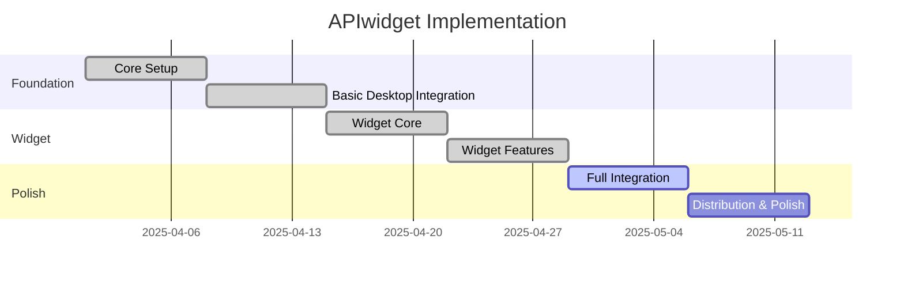

# Project Management Documentation

This folder contains documentation related to the management and tracking of the APIwidget project.

## Contents

| Document | Description | Last Updated |
|----------|-------------|--------------|
| [PROJECT_MANAGEMENT.md](./PROJECT_MANAGEMENT.md) | Project management and tracking | 2025-04-27 |
| [PROJECT_OVERVIEW.md](./PROJECT_OVERVIEW.md) | High-level project overview | 2025-04-27 |
| [SPRINT_TRACKER.md](./SPRINT_TRACKER.md) | Active sprint tracking and planning | 2025-05-03 |
| [SPRINT_PLANNING.md](./SPRINT_PLANNING.md) | Sprint planning and status | 2025-04-27 |
| [ROADMAP.md](./ROADMAP.md) | Development roadmap | 2025-04-27 |
| [MARKET_ANALYSIS.md](./MARKET_ANALYSIS.md) | Market analysis | 2025-04-27 |
| [ORGANIZATION_SETUP.md](./ORGANIZATION_SETUP.md) | Organization setup | 2025-04-27 |
| [CLEANUP_SUMMARY.md](./CLEANUP_SUMMARY.md) | Code cleanup summary | 2025-04-27 |

## Project Overview

APIwidget is a desktop application for monitoring API costs in real-time. It features a floating widget with glass morphism design that provides at-a-glance information about API usage and costs across multiple providers.

### Key Features

- Floating desktop widget with glass morphism design
- Real-time API cost monitoring
- Support for multiple API providers
- Secure API key storage
- Customizable appearance and behavior

## Project Timeline

## Current Sprint: Sprint 5

**Goal**: Complete the integration of all components and prepare for initial release.

### Key Metrics

- **Sprint Duration**: 1 week
- **Story Points Planned**: 21
- **Story Points Completed**: In progress
- **Velocity (Avg. Last 3 Sprints)**: 14 points/sprint

### Current Status

- Initial integration between widget and main application
- Basic deep linking functionality
- Widget state synchronization with main app
- Preliminary performance optimizations
- UI component standardization

## Development Approach

1. **Modular and Simple Approach**
   - Avoid duplicates or over-engineering code
   - Check existing implementations before creating new ones
   - Favor clean, maintainable solutions over complex ones

2. **Single Source of Truth**
   - Maintain a clean code structure
   - Avoid redundant files and messy organization
   - Use a consistent approach to state management

3. **Step-by-Step Implementation**
   - Follow a test-then-implement methodology
   - Make small, incremental changes
   - Validate each step before moving to the next

4. **Modern UI/UX Design**
   - Implement minimal modern 2025 UI/UX
   - Focus on glass-like, low-impact UI design
   - Prioritize functionality that delivers value quickly

## Purpose

The project management documentation provides information about the project's goals, timeline, development approach, and current status. It serves as a reference for tracking progress, planning future work, and understanding the overall direction of the project.

## Audience

- Project managers
- Product owners
- Development team
- Stakeholders

## Maintenance

Project management documentation should be updated at the end of each sprint or milestone, when project goals change, or when development approaches are modified. All documents should be reviewed at least quarterly to ensure they remain accurate and up-to-date with the current state of the project.
